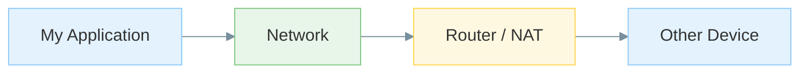
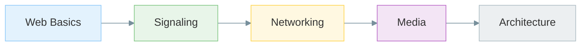

# Prerequisites (for my path)

## Goal

This repository teaches WebRTC, not general web development.

I assume I already understand the basics of building web applications and can read JavaScript examples without needing every language feature explained from first principles.

When I forget details, I prefer referencing MDN or official documentation rather than re-teaching those topics here.

---

## Core Web Skills

I assume I am comfortable with:

* **HTML** — structure for pages that host calls, chat, or collaboration features.
* **CSS** — layout for local preview windows, controls, and simple application UIs.
* **JavaScript** — callbacks, promises/async-await, DOM events, modules, and basic debugging.

These skills are sufficient for following the browser examples throughout this repository.

---

## Helpful but Not Blocking

| Topic                 | Why it helps                                                                                                             |
| --------------------- | ------------------------------------------------------------------------------------------------------------------------ |
| **Node.js**           | Small signaling servers and WebSocket-based demos are easier to understand.                                              |
| **TCP/UDP basics**    | NAT traversal, ICE, STUN, TURN, and firewall behavior make more sense.                                                   |
| **HTTPS / localhost** | Camera, microphone, and some browser APIs require secure contexts.                                                       |
| **Browser DevTools**  | Console, Network tab, and WebSocket inspection help solve many issues before WebRTC-specific debugging tools are needed. |

I do not need to be an expert in these topics before starting.

---

## Networking Expectations

I do **not** need to understand:

* SDP
* ICE
* STUN
* TURN
* DTLS
* RTP
* RTCP

before beginning.

Those topics are introduced gradually throughout the repository.

I only need a rough understanding that devices communicate across networks and that routers, firewalls, and NATs can make direct communication difficult.

### Mermaid



### ASCII Fallback

```text
My Application
       │
       ▼
    Network
       │
       ▼
  Router / NAT
       │
       ▼
  Other Device
```

WebRTC exists partly to help establish reliable communication paths across these network boundaries.

---

## How I Study Weak Areas

If networking feels fuzzy, I pair the networking notes with practical experiments only after I understand the terminology.

Examples:

* Read the ICE notes before opening Wireshark.
* Learn what STUN does before analyzing packets.
* Understand TURN before worrying about relay costs.

If Node.js feels rusty, I start with the signaling demos before moving into peer connection examples.

---

## Learning Path

The repository is designed to build understanding incrementally.

### Mermaid



### ASCII Fallback

```text
Web Basics
      ↓
Signaling
      ↓
Networking
      ↓
Media
      ↓
Architecture
```

I focus on understanding concepts first, then protocols, then browser APIs, and finally complete systems.

---

## What I Should Remember

* WebRTC assumes basic web development knowledge.
* JavaScript and async programming are the most important prerequisites.
* Networking knowledge helps, but I can learn it incrementally.
* Browser DevTools are often my first debugging tool.
* I do not need to understand every protocol before getting started.
* The repository introduces concepts in the same order they appear in real-world systems.
* Learning the mental model is more important than memorizing acronyms.
