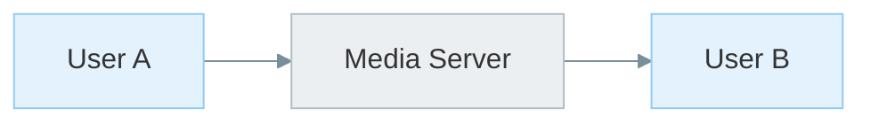
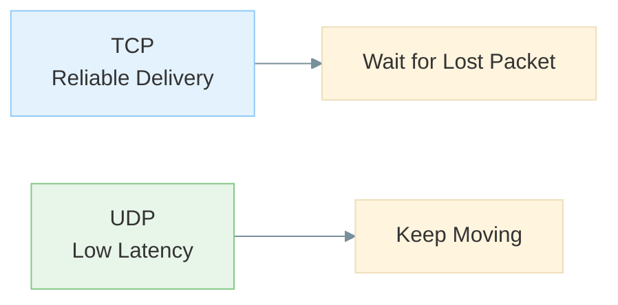
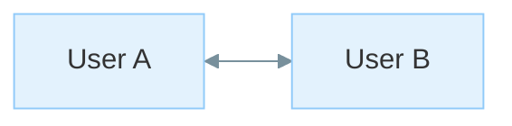
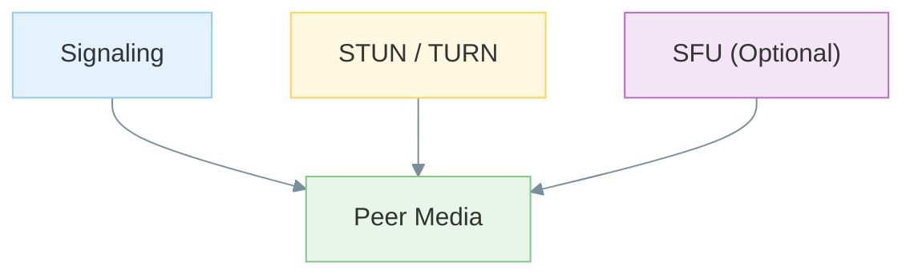

# Why WebRTC Exists

## The Old Pattern: Everything Through My Server

In classic web chat systems and many early video products, **my server** often carried every byte between users.

That model is easy to reason about:

```text
Client A
    │
    ▼
 Server
    ▲
    │
Client B
```

Clients only communicate with infrastructure I control.

For many web applications, that approach works well.

---

## Why That Breaks at Scale for Live Media

Voice and video are very different from text messages.

A server that relays media must:

* Receive media streams
* Process media streams
* Re-send media streams

for every participant.

As concurrency grows:

* Bandwidth costs increase
* CPU usage increases
* Infrastructure costs increase

#### Mermaid



#### ASCII Fallback

```text
User A
   │
   ▼
Media Server
   │
   ▼
User B
```

At large scale, relaying every media packet becomes expensive.

---

## Another Reason the Classic Web Struggled

Traditional web traffic primarily uses **TCP**.

TCP guarantees delivery and ordering, which is ideal for:

* HTML
* CSS
* JavaScript
* API responses
* Downloads

If a packet is lost, TCP pauses and retransmits before continuing.

#### Mermaid



#### ASCII Fallback

```text
TCP
 └─ Lost packet
        ↓
   Wait and retransmit

UDP
 └─ Lost packet
        ↓
   Continue moving
```

For live media, waiting can be worse than losing a single frame.

Most users prefer:

```text
Drop one video frame
```

over:

```text
Freeze the entire call
```

WebRTC provides a browser-safe way to use UDP-based real-time communication.

---

## The Design Goal

Engineers wanted endpoints to exchange live data **without requiring a central relay for every
media packet**, whenever the network allows it.

Benefits I care about:

* **Lower relay cost** when direct paths work.
* **Shorter network paths** that may reduce latency.
* **More efficient bandwidth usage** because media does not always need a middle hop.
* **Less centralized inspection** of raw media (though signaling and TURN infrastructure still
  exist).

#### Mermaid



#### ASCII Fallback

```text
User A  <========>  User B
```

When a direct path works, media can travel without a relay in the middle.

---

## What Actually Shipped

Browsers received a standardized real-time communication stack.

However, servers did **not** disappear.

Real WebRTC systems still use:

* Signaling servers
* STUN servers
* TURN servers
* SFUs for larger meetings

WebRTC is a compromise:

```text
Direct media when possible
           +
Practical fallbacks when necessary
```

#### Mermaid



#### ASCII Fallback

```text
Signaling
     │
     ▼
 STUN / TURN
     │
     ▼
 Peer Media
     ▲
     │
 Optional SFU
```

---

## Why I Am Studying It Now

Real-time communication is no longer a niche feature.

It appears in:

* Meetings
* Telehealth
* Customer support
* Gaming
* Collaboration tools
* Remote cameras
* Robotics and IoT systems

Understanding WebRTC helps me:

* Debug calls that fail on hotel Wi-Fi.
* Explain TURN relay costs.
* Design applications that degrade gracefully.
* Understand the trade-offs between latency, reliability, and cost.

---

## What I Should Remember

* Traditional web traffic was not designed for low-latency media.
* TCP prioritizes reliability; real-time communication often prioritizes latency.
* Relaying all media through servers becomes expensive at scale.
* WebRTC enables direct media paths when networks allow.
* Servers are still required for signaling, NAT traversal, and group communication.
* WebRTC is a practical compromise between peer-to-peer communication and real-world infrastructure.
