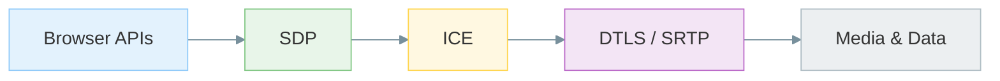
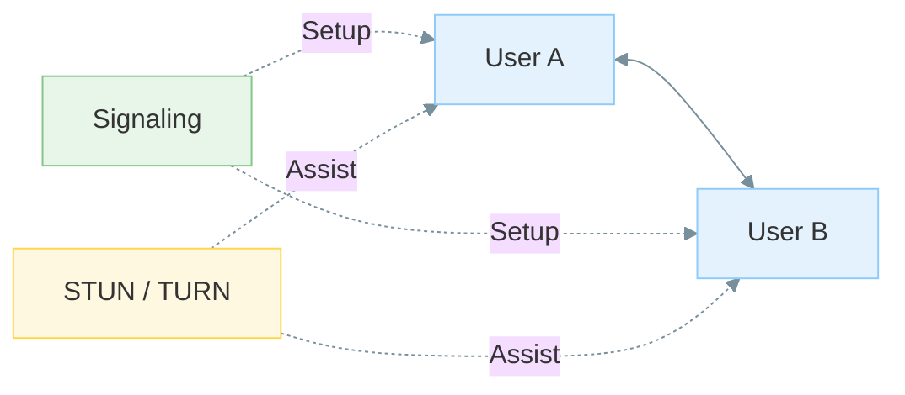
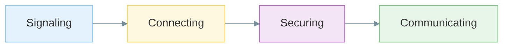
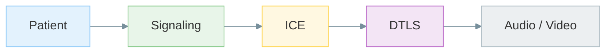

# What WebRTC Is

## Plain English

WebRTC (**Web Real-Time Communication**) is a collection of browser APIs, protocols, and standards that allow applications to exchange **live data** with **low latency**.

The data may be:

* Audio
* Video
* Text
* Files
* Arbitrary binary data

The "RTC" part means **real-time communication**.

The goal is for the other side to receive updates shortly after they are sent rather than waiting for page refreshes, polling intervals, or manual synchronization.

---

## WebRTC Is Not One Thing

WebRTC is often discussed as if it were a single technology.

In reality, it is a collection of pieces that work together.

Examples include:

* Browser APIs
* SDP
* ICE
* STUN
* TURN
* DTLS
* SRTP
* RTP
* RTCP

I do not need to understand all of these immediately.

This repository introduces them one step at a time.

### Mermaid



### ASCII Fallback

```text
Browser APIs
       ↓
      SDP
       ↓
      ICE
       ↓
 DTLS / SRTP
       ↓
 Media & Data
```

---

## Where I See It In The Wild

WebRTC appears in far more places than video meetings.

Examples:

* Video conferencing
* Voice calls
* Screen sharing
* File transfer
* Cloud gaming
* Telehealth
* Customer support systems
* Remote cameras
* Smart home monitoring
* Robotics and drones
* Industrial remote-control systems

Different products use different pieces of WebRTC, but the underlying ideas remain similar.

---

## Is It Peer-to-Peer?

**Partly.**

Media is often designed to flow directly between endpoints once a path has been established.

However, infrastructure is still required.

I usually need:

* Signaling servers
* STUN servers
* TURN servers
* Sometimes SFUs for larger meetings

So I treat:

```text
WebRTC is peer-to-peer
```

as shorthand for:

```text
Media may be peer-to-peer.
Infrastructure still exists.
```

### Mermaid



### ASCII Fallback

```text
         Signaling
          /    \
         /      \
    User A <----> User B
         \      /
          \    /
        STUN/TURN
```

---

## Four Phases I Keep In Mind

I use a simple mental model for every WebRTC connection.

### Mermaid



### ASCII Fallback

```text
Signaling
     ↓
Connecting
     ↓
Securing
     ↓
Communicating
```

Later, I expand this in:

```text
02_webrtc_architecture/four-steps.md
```

The phases are:

1. **Signaling** — agree to start a session and exchange metadata.
2. **Connecting** — discover viable network paths using ICE.
3. **Securing** — establish encryption using DTLS and related technologies.
4. **Communicating** — exchange media or arbitrary data.

---

## Real-World Anchor

Consider a two-person telehealth consultation.

The process looks like:

### Mermaid



### ASCII Fallback

```text
Patient
    ↓
Signaling
    ↓
ICE
    ↓
DTLS
    ↓
Audio / Video
```

First signaling establishes the session.

Then ICE searches for a workable network path.

After that, encryption is established.

Only then do audio and video begin flowing.

TURN acts as a fallback when direct connectivity cannot be established.

---

## What I Should Remember

* WebRTC enables low-latency communication.
* WebRTC is not a single protocol; it is a collection of technologies.
* Media may flow peer-to-peer, but infrastructure is still required.
* Signaling is outside the WebRTC specification itself.
* Every connection passes through signaling, connectivity, security, and communication phases.
* Understanding the lifecycle is more important than memorizing protocol names.

This file becomes the bridge between:

```text
Why WebRTC Exists
```

and

```text
How WebRTC Actually Works
```
