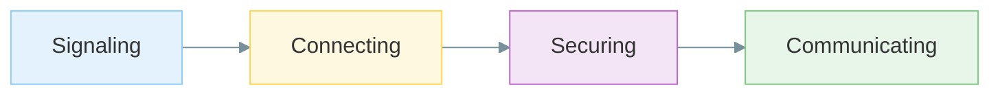

# The Four Phases of a WebRTC Connection

## Plain English

A WebRTC connection is not established in a single step.

Before audio, video, or data can flow, several things must happen in a specific order:

1. The peers must agree to communicate.
2. The peers must find a network path.
3. The peers must establish encryption.
4. The peers can finally exchange media or data.

I use this four-phase model whenever I study WebRTC or debug call failures.

---

## The High-Level Flow

### Mermaid



### ASCII Fallback

```text
Signaling
     ↓
Connecting
     ↓
Securing
     ↓
Communicating
```

Each phase depends on the previous one succeeding.

If a phase fails, the connection cannot move forward.

---

## 1. Signaling

Before browsers can connect, they must learn about each other.

At this stage, the peers exchange information such as:

- Session descriptions
- Network candidates
- Call metadata

Typical transports include:

- WebSockets
- HTTPS APIs
- Messaging systems

An important detail:

```text
Signaling is not defined by WebRTC.
```

The WebRTC specifications expect signaling to exist, but they do not require a specific protocol or server implementation.

### Typical Failures

- Signaling server unavailable
- Invalid session descriptions
- Messages delivered in the wrong order
- Application-level bugs

---

## 2. Connecting

Once signaling succeeds, the peers attempt to find a usable network path.

Real devices are usually behind:

- NATs
- Routers
- Firewalls

Finding a path is the responsibility of ICE (Interactive Connectivity Establishment).

During this phase:

- Candidate addresses are gathered.
- Candidate pairs are tested.
- Connectivity checks determine what works.

Supporting infrastructure often includes:

- STUN servers
- TURN servers

### Typical Failures (Connecting)

- Firewall restrictions
- Blocked UDP traffic
- Incorrect STUN/TURN configuration
- No viable candidate pair found

---

## 3. Securing

After a working network path is discovered, the connection must be secured.

WebRTC requires encryption.

The peers establish trust and negotiate cryptographic keys before application data can flow.

Internally, technologies such as DTLS and SRTP are involved, but at this stage I only need the mental model:

```text
No encryption
      ↓
Key agreement
      ↓
Secure connection
```

### Typical Failures (Securing)

- Certificate fingerprint mismatches
- Handshake failures
- Network devices interfering with traffic

---

## 4. Communicating

Only after the connection is negotiated, connected, and secured does useful data begin flowing.

This may include:

### Media

- Microphone audio
- Camera video
- Screen sharing

### Data

- Chat messages
- Files
- Game state
- Collaborative editing events

At this point, the application finally delivers value to users.

### Typical Failures (Communicating)

- Packet loss
- Insufficient bandwidth
- Codec issues
- Device performance limitations

---

## A Useful Debugging Habit

When a call fails, I avoid asking:

```text
Why is WebRTC broken?
```

Instead, I ask:

```text
Which phase failed?
```

1. Did signaling succeed?
2. Did ICE find a path?
3. Did encryption complete?
4. Is media or data actually flowing?

Most WebRTC troubleshooting becomes much easier once the failure is mapped to the correct phase.

---

## Relationship to Later Topics

This file intentionally stays at a high level.

The next modules explore the details behind each phase:

| Phase | Topics |
|---------|---------|
| Signaling | SDP, offers, answers |
| Connecting | ICE, STUN, TURN |
| Securing | DTLS, certificates, SRTP |
| Communicating | RTP, RTCP, media tracks, data channels |

For now, I only need to remember that every WebRTC connection follows the same overall sequence.

---

## What I Should Remember

- Every WebRTC connection progresses through four phases.
- Signaling happens before connectivity checks.
- Connectivity checks happen before encryption.
- Encryption happens before media or data flows.
- Most WebRTC failures can be mapped to one of these phases.
- Understanding the lifecycle is more important than memorizing protocol names.
