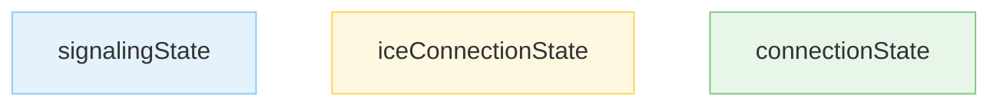

# The WebRTC Connection Lifecycle

## Plain English

In the previous note, I introduced the four conceptual phases of a WebRTC connection:

1. Signaling
2. Connecting
3. Securing
4. Communicating

Inside the browser, these phases are reflected through several state machines exposed by `RTCPeerConnection`.

The most important ones are:

* `signalingState`
* `iceConnectionState`
* `connectionState`

Understanding these states is one of the fastest ways to diagnose call failures.

When I inspect browser logs or `chrome://webrtc-internals`, these are the first values I check.

---

## Conceptual Model

The four phases and the browser states are related, but they are not identical.

```text
Conceptual Phase                  Browser State

Signaling          ───────────►   signalingState

Connecting         ───────────►   iceConnectionState

Securing           ─┐
                    ├─────────►   connectionState
Communicating      ─┘
```

The browser exposes implementation details through state machines.

The phases remain a useful mental model for understanding what is happening.

---

## The Three State Machines

### Mermaid



### ASCII Fallback

```text
signalingState
       │
iceConnectionState
       │
connectionState
```

Each state machine answers a different question.

| State Machine        | Question                                 |
| -------------------- | ---------------------------------------- |
| `signalingState`     | Are we negotiating session descriptions? |
| `iceConnectionState` | Have we found a network path?            |
| `connectionState`    | Is the overall peer connection healthy?  |

---

## 1. `signalingState`

The signaling state machine tracks Session Description Protocol (SDP) negotiation.

It answers:

```text
Where are we in the offer/answer exchange?
```

### Common States

| State               | Meaning                                        |
| ------------------- | ---------------------------------------------- |
| `stable`            | No negotiation in progress.                    |
| `have-local-offer`  | I created an offer and applied it locally.     |
| `have-remote-offer` | I received an offer and have not answered yet. |
| `closed`            | Peer connection is closed.                     |

In a normal call flow, the state repeatedly returns to:

```text
stable
```

This is the healthy resting state.

### Typical Failure Clues

If a connection remains in:

```text
have-local-offer
```

for an extended period, common causes include:

* Signaling messages not delivered
* Remote peer offline
* Application logic errors
* Invalid SDP handling

### Event

```javascript
pc.onsignalingstatechange = () => {
  console.log(pc.signalingState);
};
```

---

## 2. `iceConnectionState`

The ICE connection state machine tracks connectivity checks.

It answers:

```text
Can packets travel between peers?
```

### Common States (ICE)

| State          | Meaning                                       |
| -------------- | --------------------------------------------- |
| `new`          | ICE has not started.                          |
| `checking`     | Connectivity checks are running.              |
| `connected`    | At least one candidate pair works.            |
| `completed`    | ICE checks have finished successfully.        |
| `disconnected` | Connectivity appears temporarily interrupted. |
| `failed`       | ICE can no longer establish connectivity.     |
| `closed`       | ICE has stopped.                              |

### Typical Happy Path

```text
new
  ↓
checking
  ↓
connected
```

Sometimes:

```text
connected
  ↓
completed
```

appears afterwards.

Applications should not depend on seeing `completed`.

### Typical Failure Clues (ICE)

If ICE reaches:

```text
failed
```

possible causes include:

* Firewall restrictions
* Blocked UDP traffic
* Missing TURN server
* Incorrect TURN credentials
* Network path unavailable

### Event (ICE Connection State)

```javascript
pc.oniceconnectionstatechange = () => {
  console.log(pc.iceConnectionState);
};
```

---

## A Brief Note on `iceGatheringState`

Developers often notice another ICE-related state machine:

```text
iceGatheringState
```

This tracks candidate collection rather than connectivity.

Typical values:

```text
new
gathering
complete
```

For now, I focus on connectivity (`iceConnectionState`) and revisit candidate gathering in the ICE module.

---

## 3. `connectionState`

This is the highest-level state machine.

It aggregates information from underlying transports, including:

* ICE
* DTLS

It answers:

```text
Is the peer connection usable?
```

### Common States (Connection)

| State          | Meaning                                 |
| -------------- | --------------------------------------- |
| `new`          | Newly created.                          |
| `connecting`   | Establishing connectivity and security. |
| `connected`    | Connection is operational.              |
| `disconnected` | Temporary interruption detected.        |
| `failed`       | Connection cannot recover.              |
| `closed`       | Peer connection closed.                 |

### Important Distinction

#### `disconnected`

Usually means:

```text
Something went wrong,
but recovery may still happen.
```

Examples:

* Wi-Fi roaming
* Temporary packet loss
* Network handoff

#### `failed`

Usually means:

```text
Recovery is unlikely.
```

Examples:

* ICE permanently failed
* Transport shutdown
* Critical connection failure

### Event (Connection State)

```javascript
pc.onconnectionstatechange = () => {
  console.log(pc.connectionState);
};
```

---

## Lifecycle Timeline

A simplified call setup often looks like:

| Step               | signalingState     | iceConnectionState | connectionState |
| ------------------ | ------------------ | ------------------ | --------------- |
| Create connection  | `stable`           | `new`              | `new`           |
| Set local offer    | `have-local-offer` | `new`              | `new`           |
| Receive answer     | `stable`           | `new`              | `new`           |
| Start ICE checks   | `stable`           | `checking`         | `connecting`    |
| Working path found | `stable`           | `connected`        | `connecting`    |
| DTLS established   | `stable`           | `connected`        | `connected`     |

The exact ordering can vary slightly across browsers, but the overall progression remains similar.

> **Note**
>
> State transitions are not guaranteed to appear in exactly the same order across all browsers.
>
> The overall progression remains similar, but implementations may emit intermediate states differently.

When a call ends normally, the peer connection eventually transitions to `closed`.

---

## Debugging Strategy

When a call fails, I isolate the failing layer.

### Step 1

```text
Check signalingState
```

Did offer/answer negotiation complete?

### Step 2

```text
Check iceConnectionState
```

Did ICE find a working path?

### Step 3

```text
Check connectionState
```

Did the overall connection become operational?

This narrows the investigation quickly.

### Example: Reading Multiple States Together

Individual states are useful.

Combining them is even more powerful.

Example:

```text
iceConnectionState = connected
connectionState    = failed
```

This tells me:

```text
Network path found
        ✓

Encryption failed
        ✗
```

In other words:

* ICE successfully established connectivity.
* DTLS could not complete successfully.
* The failure is likely in the securing phase rather than the networking phase.

Learning to correlate state machines dramatically reduces debugging time.

---

## What I Should Remember

* `signalingState` tracks SDP negotiation.
* `iceConnectionState` tracks network connectivity.
* `connectionState` tracks overall connection health.
* `iceGatheringState` tracks candidate collection.
* `disconnected` often means temporary trouble.
* `failed` usually means recovery is unlikely.
* State transitions provide some of the most valuable debugging information in WebRTC.
* Understanding the lifecycle is more useful than memorizing every individual state.
