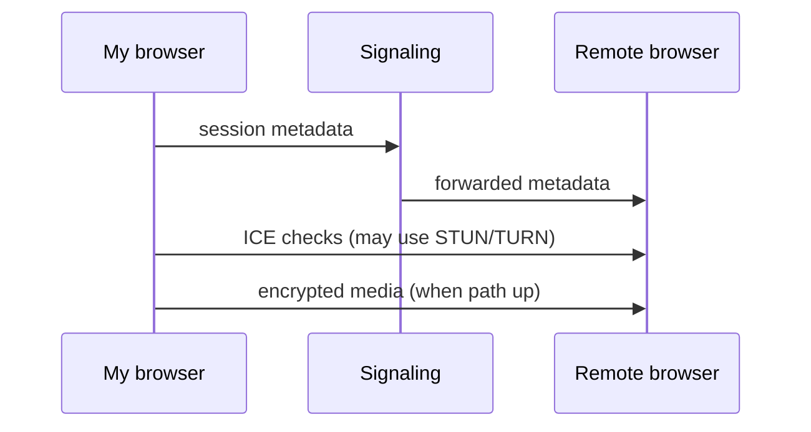

# Four steps in a WebRTC session

I use this map before diving into individual protocols. Details land in later modules; this is the **shape** of a call.

## 1. Signaling (out of band)

Browsers do not magically discover each other. I need a channel—often WebSockets or HTTPS—to exchange:

- “User A wants a video call with User B.”
- Session descriptions (SDP) and ICE candidates once I generate them.

Signaling is **not** standardized by WebRTC itself; I pick the transport and message format.

## 2. Connecting (ICE)

Each side proposes network paths (host, server-reflexive, relay). ICE checks pairs until one works or times out. STUN reveals reflexive addresses; TURN supplies relay candidates when needed.

## 3. Securing (DTLS-SRTP, certs)

After ICE selects a pair, DTLS establishes keys; SRTP protects media. I do not implement crypto by hand—the stack negotiates parameters described in SDP.

## 4. Communicating (media / data)

- **Media tracks** — microphone, camera, screen.
- **Data channels** — arbitrary messages or files.

This step is the piece most people mean by “peer-to-peer media.”



## ASCII fallback

```text
Signaling server:  "here is SDP + ICE for both sides"
STUN/TURN:         "here are reachable addresses / relay"
Browsers:          ICE up → DTLS-SRTP → audio/video/data
```
