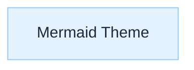
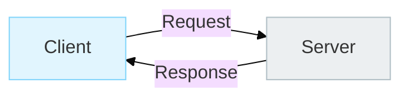
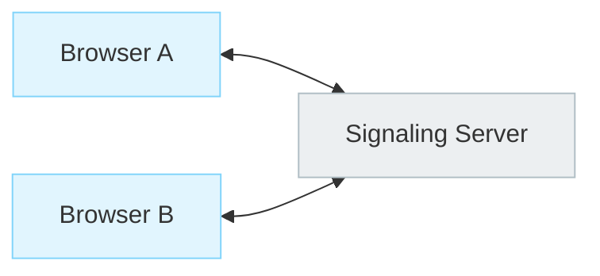
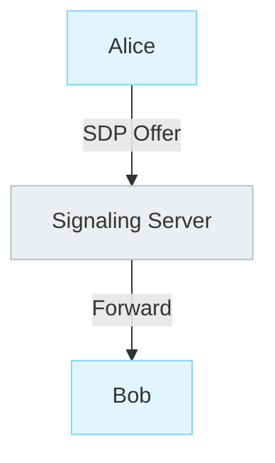
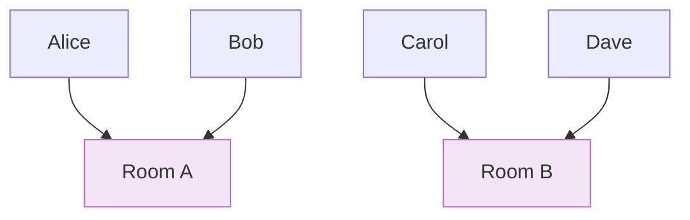
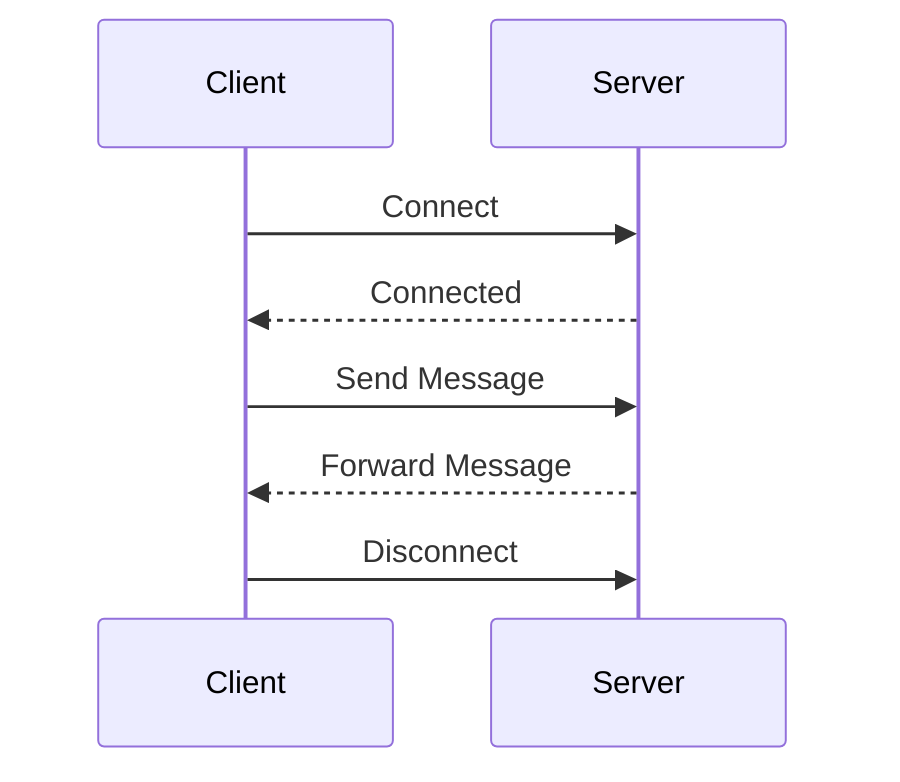
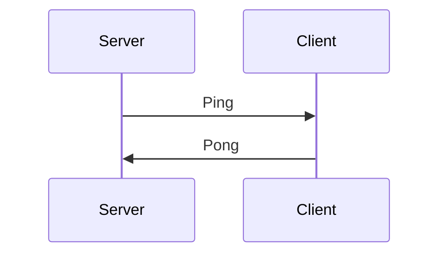
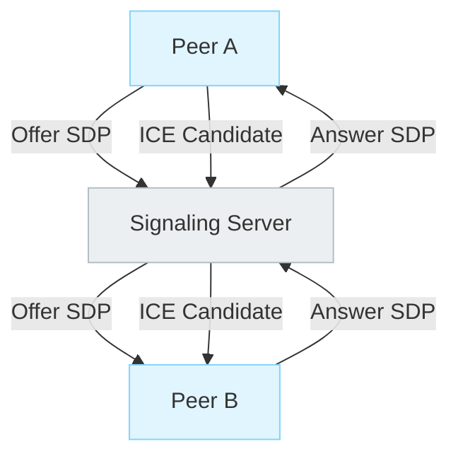

# WebSockets (Signaling Transport)

## Mermaid Theme



> **Color Convention**
>
> * Signaling → Light Blue
> * ICE → Light Green
> * DTLS → Light Amber
> * RTP/SRTP → Light Purple
> * Peers → Light Cyan
> * Servers → Light Gray

---

## Purpose

I study WebSockets as a **bidirectional communication channel**.

Many WebRTC applications use WebSockets for signaling because both sides need to exchange messages immediately during call setup.

WebRTC itself does not require WebSockets, but WebSockets are one of the most common signaling transports.

---

## Why Learn WebSockets Before WebRTC

Building a chat application teaches me:

* Persistent connections
* Bidirectional messaging
* User presence
* Message routing
* Session management

without introducing:

* SDP
* ICE
* STUN
* TURN
* Codec negotiation

This separates signaling problems from media problems.

---

## Request–Response vs Real-Time Communication

### Mermaid



### ASCII Fallback

```text
Client ---- Request ----> Server
Client <--- Response ---- Server
```

Traditional HTTP works well when:

* A response can wait
* The client initiates communication
* Updates are infrequent

Examples:

* Product pages
* Dashboards
* REST APIs

---

## Why Chat and Call Setup Feel Different

Chat messages and call signaling require low latency.

Waiting for a polling interval introduces noticeable delays.

Examples:

* New chat message
* Incoming call
* Call accepted
* Call rejected
* ICE candidate exchange

These events should propagate immediately.

---

## WebSocket Mental Model

A WebSocket connection is:

* Persistent
* Bidirectional
* Full duplex

Either side can send messages at any time.

### Mermaid



### ASCII Fallback

```text
Browser A <=========> Server
Browser B <=========> Server
```

The connection remains open until one side closes it.

---

## WebRTC Signaling Through WebSockets

WebRTC does not care how signaling happens.

It only requires a mechanism to exchange messages.

Examples:

* WebSockets
* Server-Sent Events
* MQTT
* SIP
* HTTP Long Polling
* QR Codes
* Manual Copy/Paste

WebSockets are commonly used because they provide a low-latency bidirectional channel.

---

## The Signaling Server Is a Router

The signaling server is not merely a transport pipe.

Its job is to route messages to the correct destination.

### Mermaid



### ASCII Fallback

```text
Alice
  |
SDP Offer
  |
Signaling Server
  |
Forward
  |
Bob
```

The server must know:

* Who sent the message
* Who should receive it
* Which connection belongs to which user

---

## User Registry

A signaling server typically maintains a registry.

### Concept

```text
userId -> WebSocket Connection
```

Example:

```text
alice -> ws#1
bob   -> ws#2
carol -> ws#3
```

When Alice sends a message for Bob:

```text
Lookup "bob"
      ↓
Find ws#2
      ↓
Forward message
```

---

## Typed Message Envelope

Avoid sending raw strings.

Use a structured message format from the beginning.

```json
{
  "type": "sdp-offer",
  "sender": "alice",
  "target": "bob",
  "payload": {
    "...": "..."
  }
}
```

Benefits:

* Easier debugging
* Easier routing
* Easier validation
* Supports future message types

---

## Common Message Types

```text
chat-message
user-joined
user-left

sdp-offer
sdp-answer
ice-candidate

call-accepted
call-rejected
```

The signaling server forwards messages based on the message type.

---

## Rooms and Sessions

Broadcasting every message to every connected client does not scale.

Instead, users belong to rooms or sessions.

### Mermaid



### ASCII Fallback

```text
Room A
 ├─ Alice
 └─ Bob

Room B
 ├─ Carol
 └─ Dave
```

Messages remain within the room.

---

## Connection Lifecycle

### Mermaid



### ASCII Fallback

```text
Connect
   ↓
Exchange Messages
   ↓
Disconnect
```

---

## Production Reality: Connections Drop

A WebSocket connection is long-lived.

Networks change.

Users:

* Close laptops
* Switch WiFi
* Move to cellular
* Lose connectivity

The connection may disappear unexpectedly.

---

## Heartbeats

Production systems typically implement:

```text
Ping
 ↓
Pong
```

to verify the connection is still alive.

### Mermaid



### ASCII Fallback

```text
Server ---- Ping ----> Client
Server <--- Pong ----- Client
```

---

## Relation to WebRTC

The same signaling server later forwards:

* SDP offers
* SDP answers
* ICE candidates

### Mermaid



### ASCII Fallback

```text
Peer A
   |
Offer SDP
   |
Signaling Server
   |
Offer SDP
   |
Peer B
```

The WebSocket server never carries audio or video.

It only carries signaling messages.

---

## Real-World Use Case

A multiplayer lobby announces:

```text
Match Found
```

to connected users.

The same transport pattern later forwards:

* SDP offers
* SDP answers
* ICE candidates

The architecture remains the same.

Only the message payload changes.

---

## Key Takeaway

WebSockets provide a:

* Persistent connection
* Bidirectional channel
* Low-latency transport

for exchanging signaling messages.

Mental model:

```text
WebSocket
    ↓
Signaling Transport
    ↓
Exchange SDP / ICE
    ↓
WebRTC Connection
```

WebSockets do not carry media.

They help peers coordinate so media can flow directly between them.
