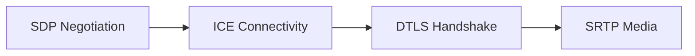
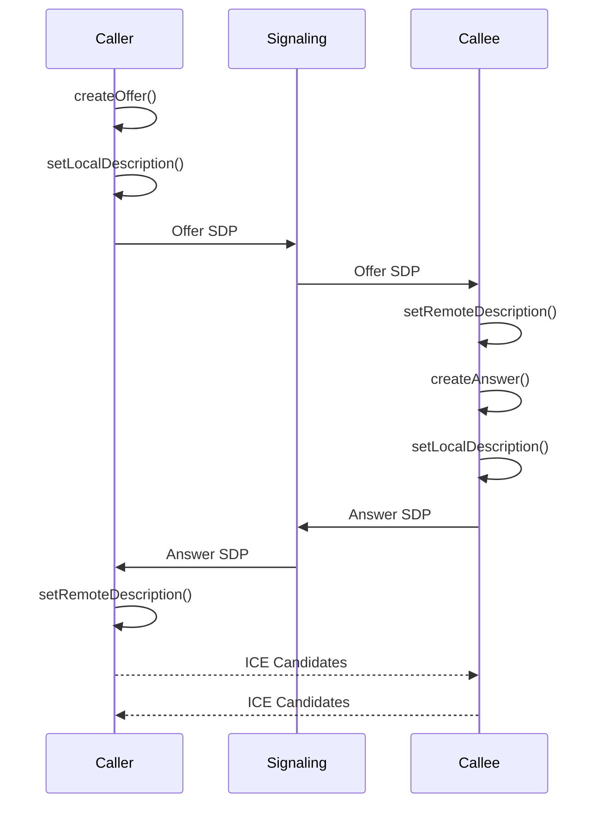
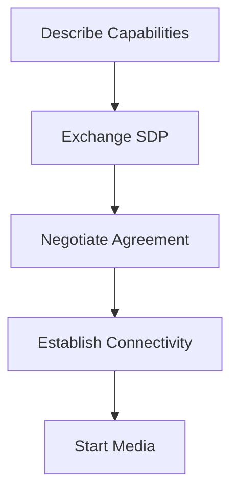

# SDP Offer and Answer

## Plain English

**SDP (Session Description Protocol)** is a text description of a communication session.

It answers:

* Which media streams exist (audio, video, data channel)
* Which codecs each side supports
* How media is secured (DTLS)
* ICE configuration needed to establish connectivity

In WebRTC, SDP is exchanged through the **signaling channel** (WebSocket, SIP, HTTP, etc.), not over
the media transport itself.

Think of SDP as a **capabilities negotiation document**.

---

## Connection Lifecycle

### Connection Lifecycle Diagram

#### Mermaid



#### ASCII Diagram

```text
SDP Negotiation
       ↓
ICE Connectivity
       ↓
DTLS Handshake
       ↓
SRTP Media
```

### Mental Model

Each layer has a distinct responsibility:

| Layer | Responsibility              |
| ----- | --------------------------- |
| SDP   | Negotiate capabilities      |
| ICE   | Find a working network path |
| DTLS  | Secure the connection       |
| SRTP  | Carry audio/video securely  |

---

## Offer / Answer Roles

| Step | Side   | What Happens                                            |
| ---- | ------ | ------------------------------------------------------- |
| 1    | Caller | Creates an offer SDP and calls `setLocalDescription()`  |
| 2    | Caller | Sends offer through signaling                           |
| 3    | Callee | Calls `setRemoteDescription(offer)`                     |
| 4    | Callee | Creates an answer SDP and calls `setLocalDescription()` |
| 5    | Callee | Sends answer through signaling                          |
| 6    | Caller | Calls `setRemoteDescription(answer)`                    |
| 7    | Both   | Exchange ICE candidates while signaling remains active  |

I treat the offer/answer state machine as strict.

Glares (both sides offering simultaneously) require a negotiation policy; I learn the happy path first.

---

## Offer / Answer Flow

### Offer Answer Sequence Diagram

#### Mermaid



#### ASCII Diagram

```text
Caller                  Callee
  |                        |
  |---- Offer SDP -------->|
  |                        |
  |<--- Answer SDP --------|
  |                        |
  |<== ICE Candidates ====>|
  |                        |
  |------ Connected ------>|
```

---

## What I Look For in an SDP Blob (Without Memorizing Every Line)

### Media Sections

```text
m=audio
m=video
m=application
```

Indicates which media sections exist.

Common examples:

* Audio
* Video
* Data Channel

---

### Codec Definitions

```text
a=rtpmap:111 opus/48000/2
```

Maps payload types to codecs.

Examples:

| Payload Type | Codec |
| ------------ | ----- |
| 111          | Opus  |
| 96           | VP8   |
| 98           | VP9   |
| 102          | H.264 |

The exact payload numbers can vary between sessions.

---

### Security

```text
a=fingerprint
```

Contains the DTLS certificate fingerprint used to authenticate the peer.

Without successful DTLS negotiation, media cannot flow.

---

### ICE Configuration

```text
a=ice-ufrag
a=ice-pwd
```

Provides ICE credentials used during connectivity checks.

Candidates may appear as:

```text
a=candidate:...
```

or arrive separately via trickle ICE.

---

### Media Direction

```text
a=sendrecv
a=sendonly
a=recvonly
a=inactive
```

Controls media direction.

Examples:

| Attribute | Meaning          |
| --------- | ---------------- |
| sendrecv  | Send and receive |
| sendonly  | Send only        |
| recvonly  | Receive only     |
| inactive  | Neither          |

Useful when implementing:

* Hold / resume
* Streaming
* Broadcasting
* Muting through renegotiation

---

### Media Identifier (MID)

```text
a=mid:0
```

Identifies a media section.

Modern WebRTC internally maps media through transceivers.

Mental model:

```text
MID
 ↓
Transceiver
 ↓
Sender / Receiver
 ↓
Track
```

When debugging browser internals, MIDs appear frequently.

---

### Transport Bundling

```text
a=group:BUNDLE 0 1
```

Allows multiple media sections to share a single transport.

Instead of:

```text
Audio → Transport A
Video → Transport B
```

BUNDLE enables:

```text
Audio
Video
DataChannel
      ↓
Single ICE Connection
Single DTLS Connection
```

Modern WebRTC almost always uses BUNDLE.

---

## Worked Example (Two Browser Tabs)

### Step 1

Tab A calls:

```javascript
const offer = await pc.createOffer();
await pc.setLocalDescription(offer);
```

Offer SDP is sent through a WebSocket signaling server.

### Step 2

Tab B receives the offer:

```javascript
await pc.setRemoteDescription(offer);
```

Creates an answer:

```javascript
const answer = await pc.createAnswer();
await pc.setLocalDescription(answer);
```

Answer SDP is sent back.

### Step 3

Both peers exchange ICE candidates:

```javascript
pc.addIceCandidate(candidate);
```

as candidates arrive.

### Step 4

ICE discovers a valid network path.

### Step 5

DTLS establishes encryption.

### Step 6

SRTP media begins flowing.

### Step 7

Connection state becomes:

```javascript
connected
```

---

## Debugging Sandbox

When developing WebRTC applications, I rarely inspect SDP using `console.log()`.

Instead I use browser diagnostics tools.

### Chrome / Edge

```text
chrome://webrtc-internals
```

### Firefox

```text
about:webrtc
```

These tools provide:

* SDP offer/answer history
* ICE candidate exchange
* Candidate pair selection
* DTLS state transitions
* RTP/SRTP statistics
* Audio/video quality metrics
* Connection state changes

In practice, these tools are often more valuable than application logs.

---

## Real-World Use Case

A browser softphone may register using SIP over WebSocket.

A browser-to-browser application may use a custom WebSocket signaling server.

The signaling format changes, but the negotiation pattern remains the same.

### SDP Negotiation Process Diagram

#### Mermaid



#### ASCII Diagram

```text
Describe Capabilities
          ↓
Exchange SDP
          ↓
Negotiate Agreement
          ↓
Establish Connectivity
          ↓
Start Media
```

---

## Common Failure Modes

### SDP Negotiation Issues

Symptoms:

* Offer rejected
* Answer rejected
* Codec mismatch

Typical causes:

* Unsupported codec
* Invalid SDP
* Incorrect negotiation sequence

---

### ICE Failure

Symptoms:

```text
iceConnectionState = failed
```

Typical causes:

* NAT traversal problems
* Missing STUN server
* TURN server unavailable
* Firewall restrictions

---

### DTLS Failure

Symptoms:

```text
connectionState = failed
```

after ICE succeeds.

Typical causes:

* Certificate issues
* DTLS negotiation failure

---

### One-Way Media

Symptoms:

* Audio/video only works in one direction

Typical causes:

* Direction mismatch (`sendonly`, `recvonly`)
* Firewall issues
* Track/transceiver configuration errors

---

### Renegotiation Problems

Symptoms:

* Tracks fail after adding/removing media
* Glare conditions
* Stuck signaling states

Typical causes:

* Concurrent offers
* Incorrect signaling logic

---

## What I Defer

I do not memorize:

* Full SDP grammar
* Every SDP attribute
* Codec payload mappings
* RFC attribute definitions

When I need exact syntax, I consult:

* RFC 8866 (SDP)
* RFC 3264 (Offer/Answer)
* RFC 8445 (ICE)

I remember the concepts and look up the precise details when needed.

---

## Key Takeaway

SDP is not the media transport.

SDP is the negotiation document that allows two peers to agree on:

* What media to exchange
* Which codecs to use
* How to secure the session
* How ICE should establish connectivity

The WebRTC connection lifecycle is:

```text
SDP → ICE → DTLS → SRTP
```

If I understand that sequence, I understand the foundation of every WebRTC connection.
