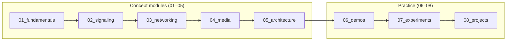

# `src/` — WebRTC learning path

Personal study tree for WebRTC: concepts first, then runnable demos, experiments, and projects.

Full layout rules: [docs/01-repository-structure.md](../docs/01-repository-structure.md).

## Table of contents

- [Learning path (order)](#learning-path-order)
- [01 — Fundamentals](#01--fundamentals)
  - [01_webrtc_introduction](01_fundamentals/01_webrtc_introduction/README.md)
  - [02_webrtc_architecture](01_fundamentals/02_webrtc_architecture/README.md)
  - [03_browser_apis](01_fundamentals/03_browser_apis/)
  - [04_media_streams](01_fundamentals/04_media_streams/)
  - [05_rtc_peer_connection](01_fundamentals/05_rtc_peer_connection/)
  - [06_rtc_data_channel](01_fundamentals/06_rtc_data_channel/)
  - [07_rtp_rtcp](01_fundamentals/07_rtp_rtcp/)
  - [08_dtls_srtp](01_fundamentals/08_dtls_srtp/)
  - [09_webrtc_stats_api](01_fundamentals/09_webrtc_stats_api/)
- [02 — Signaling](#02--signaling)
  - [01_websockets](02_signaling/01_websockets/README.md)
  - [02_sdp](02_signaling/02_sdp/README.md)
  - [03_offer_answer](02_signaling/03_offer_answer/)
  - [04_signaling_server](02_signaling/04_signaling_server/README.md)
- [03 — Networking](#03--networking)
  - [01_ice](03_networking/01_ice/README.md)
  - [02_stun](03_networking/02_stun/README.md)
  - [03_turn](03_networking/03_turn/README.md)
  - [04_nat_traversal](03_networking/04_nat_traversal/)
- [04 — Media](#04--media)
  - [01_audio](04_media/01_audio/)
  - [02_video](04_media/02_video/)
  - [03_screen_sharing](04_media/03_screen_sharing/)
  - [04_codecs](04_media/04_codecs/)
- [05 — Architecture](#05--architecture)
  - [01_mesh](05_architecture/01_mesh/)
  - [02_sfu](05_architecture/02_sfu/)
  - [03_mcu](05_architecture/03_mcu/)
  - [04_scalability](05_architecture/04_scalability/)
  - [05_janus](05_architecture/05_janus/)
  - [06_mediasoup](05_architecture/06_mediasoup/)
  - [07_livekit](05_architecture/07_livekit/)
  - [08_jitsi](05_architecture/08_jitsi/)
- [06 — Demos](#06--demos)
  - [01_getusermedia](06_demos/01_getusermedia/README.md)
  - [02_local_video_preview](06_demos/02_local_video_preview/)
  - [03_websocket_signaling](06_demos/03_websocket_signaling/README.md)
  - [04_peer_connection](06_demos/04_peer_connection/)
  - [05_offer_answer](06_demos/05_offer_answer/)
  - [06_ice_candidates](06_demos/06_ice_candidates/)
  - [07_data_channel_chat](06_demos/07_data_channel_chat/)
  - [08_screen_sharing](06_demos/08_screen_sharing/)
  - [09_file_transfer](06_demos/09_file_transfer/)
  - [10_group_chat](06_demos/10_group_chat/)
- [07 — Experiments](#07--experiments)
  - [01_stun_vs_turn](07_experiments/01_stun_vs_turn/)
  - [02_codec_comparison](07_experiments/02_codec_comparison/)
  - [03_bandwidth_control](07_experiments/03_bandwidth_control/)
  - [04_packet_loss_simulation](07_experiments/04_packet_loss_simulation/)
  - [05_simulcast](07_experiments/05_simulcast/)
  - [06_sfu_scalability](07_experiments/06_sfu_scalability/)
  - [07_load_testing](07_experiments/07_load_testing/)
- [08 — Projects](#08--projects)
  - [01_video_call](08_projects/01_video_call/)
  - [02_group_video_chat](08_projects/02_group_video_chat/)
  - [03_virtual_classroom](08_projects/03_virtual_classroom/)
  - [04_webinar_platform](08_projects/04_webinar_platform/)
  - [05_zoom_clone](08_projects/05_zoom_clone/)
- [Status legend](#status-legend)

---

## Learning path (order)

### Mermaid



### ASCII fallback

```text
Concepts (read in order):
  01_fundamentals → 02_signaling → 03_networking → 04_media → 05_architecture
                              ↓
Practice (build and measure):
  06_demos → 07_experiments → 08_projects
```

---

## 01 — Fundamentals

**In this section:** [01 introduction](01_fundamentals/01_webrtc_introduction/README.md) ·
[02 architecture](01_fundamentals/02_webrtc_architecture/README.md) ·
[03 browser APIs](01_fundamentals/03_browser_apis/) ·
[04 media streams](01_fundamentals/04_media_streams/) ·
[05 peer connection](01_fundamentals/05_rtc_peer_connection/) ·
[06 data channel](01_fundamentals/06_rtc_data_channel/) ·
[07 RTP/RTCP](01_fundamentals/07_rtp_rtcp/) ·
[08 DTLS-SRTP](01_fundamentals/08_dtls_srtp/) ·
[09 stats API](01_fundamentals/09_webrtc_stats_api/)

| # | Folder | Entry | Notes |
|---|--------|-------|-------|
| 01 | [01_webrtc_introduction/](01_fundamentals/01_webrtc_introduction/) | [README](01_fundamentals/01_webrtc_introduction/README.md) | [What is WebRTC?](01_fundamentals/01_webrtc_introduction/what-is-webrtc.md) · [Why WebRTC exists](01_fundamentals/01_webrtc_introduction/why-webrtc-exists.md) · [Prerequisites](01_fundamentals/01_webrtc_introduction/prerequisites.md) |
| 02 | [02_webrtc_architecture/](01_fundamentals/02_webrtc_architecture/) | [README](01_fundamentals/02_webrtc_architecture/README.md) | [Four steps](01_fundamentals/02_webrtc_architecture/four-steps.md) |
| 03 | [03_browser_apis/](01_fundamentals/03_browser_apis/) | *(placeholder)* | |
| 04 | [04_media_streams/](01_fundamentals/04_media_streams/) | *(placeholder)* | |
| 05 | [05_rtc_peer_connection/](01_fundamentals/05_rtc_peer_connection/) | *(placeholder)* | |
| 06 | [06_rtc_data_channel/](01_fundamentals/06_rtc_data_channel/) | *(placeholder)* | |
| 07 | [07_rtp_rtcp/](01_fundamentals/07_rtp_rtcp/) | *(placeholder)* | |
| 08 | [08_dtls_srtp/](01_fundamentals/08_dtls_srtp/) | *(placeholder)* | |
| 09 | [09_webrtc_stats_api/](01_fundamentals/09_webrtc_stats_api/) | *(placeholder)* | |

[Back to top](#src--webrtc-learning-path)

---

## 02 — Signaling

**In this section:** [01 websockets](02_signaling/01_websockets/README.md) ·
[02 sdp](02_signaling/02_sdp/README.md) ·
[03 offer_answer](02_signaling/03_offer_answer/) ·
[04 signaling_server](02_signaling/04_signaling_server/README.md)

| # | Folder | Entry | Notes |
|---|--------|-------|-------|
| 01 | [01_websockets/](02_signaling/01_websockets/) | [README](02_signaling/01_websockets/README.md) | [Request vs real-time](02_signaling/01_websockets/request-response-vs-realtime.md) |
| 02 | [02_sdp/](02_signaling/02_sdp/) | [README](02_signaling/02_sdp/README.md) | [SDP offer/answer](02_signaling/02_sdp/sdp-offer-answer.md) |
| 03 | [03_offer_answer/](02_signaling/03_offer_answer/) | *(placeholder)* | |
| 04 | [04_signaling_server/](02_signaling/04_signaling_server/) | [README](02_signaling/04_signaling_server/README.md) | [What signaling does](02_signaling/04_signaling_server/what-signaling-does.md) |

[Back to top](#src--webrtc-learning-path)

---

## 03 — Networking

**In this section:** [01 ice](03_networking/01_ice/README.md) ·
[02 stun](03_networking/02_stun/README.md) ·
[03 turn](03_networking/03_turn/README.md) ·
[04 nat_traversal](03_networking/04_nat_traversal/)

| # | Folder | Entry | Notes |
|---|--------|-------|-------|
| 01 | [01_ice/](03_networking/01_ice/) | [README](03_networking/01_ice/README.md) | [Public address & NAT](03_networking/01_ice/public-address-and-nat.md) |
| 02 | [02_stun/](03_networking/02_stun/) | [README](03_networking/02_stun/README.md) | |
| 03 | [03_turn/](03_networking/03_turn/) | [README](03_networking/03_turn/README.md) | |
| 04 | [04_nat_traversal/](03_networking/04_nat_traversal/) | *(placeholder)* | |

[Back to top](#src--webrtc-learning-path)

---

## 04 — Media

**In this section:** [01 audio](04_media/01_audio/) ·
[02 video](04_media/02_video/) ·
[03 screen_sharing](04_media/03_screen_sharing/) ·
[04 codecs](04_media/04_codecs/)

| # | Folder | Entry |
|---|--------|-------|
| 01 | [01_audio/](04_media/01_audio/) | *(placeholder)* |
| 02 | [02_video/](04_media/02_video/) | *(placeholder)* |
| 03 | [03_screen_sharing/](04_media/03_screen_sharing/) | *(placeholder)* |
| 04 | [04_codecs/](04_media/04_codecs/) | *(placeholder)* |

[Back to top](#src--webrtc-learning-path)

---

## 05 — Architecture

**In this section:** [01 mesh](05_architecture/01_mesh/) ·
[02 sfu](05_architecture/02_sfu/) ·
[03 mcu](05_architecture/03_mcu/) ·
[04 scalability](05_architecture/04_scalability/) ·
[05 janus](05_architecture/05_janus/) ·
[06 mediasoup](05_architecture/06_mediasoup/) ·
[07 livekit](05_architecture/07_livekit/) ·
[08 jitsi](05_architecture/08_jitsi/)

| # | Folder | Entry |
|---|--------|-------|
| 01 | [01_mesh/](05_architecture/01_mesh/) | *(placeholder)* |
| 02 | [02_sfu/](05_architecture/02_sfu/) | *(placeholder)* |
| 03 | [03_mcu/](05_architecture/03_mcu/) | *(placeholder)* |
| 04 | [04_scalability/](05_architecture/04_scalability/) | *(placeholder)* |
| 05 | [05_janus/](05_architecture/05_janus/) | *(placeholder)* |
| 06 | [06_mediasoup/](05_architecture/06_mediasoup/) | *(placeholder)* |
| 07 | [07_livekit/](05_architecture/07_livekit/) | *(placeholder)* |
| 08 | [08_jitsi/](05_architecture/08_jitsi/) | *(placeholder)* |

[Back to top](#src--webrtc-learning-path)

---

## 06 — Demos

Incremental runnable labs — one new idea per folder.

**In this section:** [01 getusermedia](06_demos/01_getusermedia/README.md) ·
[02 local_video_preview](06_demos/02_local_video_preview/) ·
[03 websocket_signaling](06_demos/03_websocket_signaling/README.md) ·
[04 peer_connection](06_demos/04_peer_connection/) ·
[05 offer_answer](06_demos/05_offer_answer/) ·
[06 ice_candidates](06_demos/06_ice_candidates/) ·
[07 data_channel_chat](06_demos/07_data_channel_chat/) ·
[08 screen_sharing](06_demos/08_screen_sharing/) ·
[09 file_transfer](06_demos/09_file_transfer/) ·
[10 group_chat](06_demos/10_group_chat/)

| # | Folder | Entry | Notes |
|---|--------|-------|-------|
| 01 | [01_getusermedia/](06_demos/01_getusermedia/) | [README](06_demos/01_getusermedia/README.md) | Scaffold |
| 02 | [02_local_video_preview/](06_demos/02_local_video_preview/) | *(placeholder)* | |
| 03 | [03_websocket_signaling/](06_demos/03_websocket_signaling/) | [README](06_demos/03_websocket_signaling/README.md) | Runnable · [Implementation notes](06_demos/03_websocket_signaling/implementation-notes.md) |
| 04 | [04_peer_connection/](06_demos/04_peer_connection/) | *(placeholder)* | |
| 05 | [05_offer_answer/](06_demos/05_offer_answer/) | *(placeholder)* | |
| 06 | [06_ice_candidates/](06_demos/06_ice_candidates/) | *(placeholder)* | |
| 07 | [07_data_channel_chat/](06_demos/07_data_channel_chat/) | *(placeholder)* | |
| 08 | [08_screen_sharing/](06_demos/08_screen_sharing/) | *(placeholder)* | |
| 09 | [09_file_transfer/](06_demos/09_file_transfer/) | *(placeholder)* | |
| 10 | [10_group_chat/](06_demos/10_group_chat/) | *(placeholder)* | |

[Back to top](#src--webrtc-learning-path)

---

## 07 — Experiments

**In this section:** [01 stun_vs_turn](07_experiments/01_stun_vs_turn/) ·
[02 codec_comparison](07_experiments/02_codec_comparison/) ·
[03 bandwidth_control](07_experiments/03_bandwidth_control/) ·
[04 packet_loss_simulation](07_experiments/04_packet_loss_simulation/) ·
[05 simulcast](07_experiments/05_simulcast/) ·
[06 sfu_scalability](07_experiments/06_sfu_scalability/) ·
[07 load_testing](07_experiments/07_load_testing/)

| # | Folder | Entry |
|---|--------|-------|
| 01 | [01_stun_vs_turn/](07_experiments/01_stun_vs_turn/) | *(placeholder)* |
| 02 | [02_codec_comparison/](07_experiments/02_codec_comparison/) | *(placeholder)* |
| 03 | [03_bandwidth_control/](07_experiments/03_bandwidth_control/) | *(placeholder)* |
| 04 | [04_packet_loss_simulation/](07_experiments/04_packet_loss_simulation/) | *(placeholder)* |
| 05 | [05_simulcast/](07_experiments/05_simulcast/) | *(placeholder)* |
| 06 | [06_sfu_scalability/](07_experiments/06_sfu_scalability/) | *(placeholder)* |
| 07 | [07_load_testing/](07_experiments/07_load_testing/) | *(placeholder)* |

[Back to top](#src--webrtc-learning-path)

---

## 08 — Projects

**In this section:** [01 video_call](08_projects/01_video_call/) ·
[02 group_video_chat](08_projects/02_group_video_chat/) ·
[03 virtual_classroom](08_projects/03_virtual_classroom/) ·
[04 webinar_platform](08_projects/04_webinar_platform/) ·
[05 zoom_clone](08_projects/05_zoom_clone/)

| # | Folder | Entry |
|---|--------|-------|
| 01 | [01_video_call/](08_projects/01_video_call/) | *(placeholder)* |
| 02 | [02_group_video_chat/](08_projects/02_group_video_chat/) | *(placeholder)* |
| 03 | [03_virtual_classroom/](08_projects/03_virtual_classroom/) | *(placeholder)* |
| 04 | [04_webinar_platform/](08_projects/04_webinar_platform/) | *(placeholder)* |
| 05 | [05_zoom_clone/](08_projects/05_zoom_clone/) | *(placeholder)* |

[Back to top](#src--webrtc-learning-path)

---

## Status legend

| Label | Meaning |
|-------|---------|
| **Runnable** | Has `package.json` (or static app) and documented run steps |
| **Scaffold** | README only; code not started |
| *(placeholder)* | Folder reserved (`.gitkeep`); no README yet |

Shared repo assets: [../assets/](../assets/) (not under `src/`).

[Back to top](#src--webrtc-learning-path)
